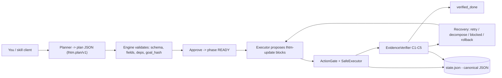

<div align="center">

# LHTM v2 - Long Horizon Task Manager

**Deterministic engine + skill pack untuk eksekusi task agen jangka panjang secara aman, verifiable, dan teraudit.**
**A deterministic engine + skill pack for safe, verifiable, auditable long-horizon agentic task execution.**

[](./LICENSE)
[](https://www.python.org)
[](https://pyyaml.org)
[](./tests)
[](./skills)
[](.)
[](./.github/workflows)
[](#kontribusi)

</div>

---

## Daftar Isi

- [Tentang Proyek](#tentang-proyek)
- [Highlights - Fitur Utama](#highlights---fitur-utama)
- [Arsitektur](#arsitektur)
- [Tech Stack](#tech-stack)
- [Dokumentasi](#dokumentasi)
- [Quick Start](#quick-start)
- [Prasyarat](#prasyarat)
- [Deep-dive: Mesin Keamanan](#deep-dive-mesin-keamanan)
- [Testing Manual](#testing-manual)
- [API Reference](#api-reference)
- [Parameter & Aturan](#parameter--aturan)
- [Troubleshooting](#troubleshooting)
- [Struktur Direktori](#struktur-direktori)
- [Kontribusi](#kontribusi)
- [Lisensi](#lisensi)
- [Acknowledgments](#acknowledgments)

---

## Tentang Proyek

LHTM v2 mengubah "minta agen mengerjakan tugas multi-langkah yang besar" menjadi proses
terstruktur, teraudit, dan aman. Alih-alih mempercayai LLM, LHTM memisahkan kerja antara
**LLM yang mengusulkan** dan **engine deterministik yang memvalidasi dan memutuskan**.

LHTM membosankan dengan sengaja. Engine tidak pernah percaya begitu saja pada model:
setiap transisi state, penulisan file, dan perintah harus lolos pemeriksaan deterministik,
dan tidak ada task yang menjadi `verified_done` tanpa bukti yang terverifikasi. Kandang
keamanannya dibangun di kode, bukan di prompt.

```
LLM proposes. Engine validates. Evidence decides.
JSON canonical state. Markdown hanya generated view.
Eksekusi terikat active_task_id.
Guardrail deterministik, bukan hanya prompt.
```

Dua permukaan yang di-package menjadi satu repo:

| Surface | Isi | Konsumen |
|---------|-----|----------|
| **Engine** (Python) | `engine/lhtm/` (14 modul), `eval/` harness, `scripts/`, `example/` | Developer, CI, operator yang menjalankan guardrail nyata |
| **Skill pack** (markdown) | `skills/<name>/SKILL.md` x6, installable via skills.sh | Claude Code / Antigravity / Codex |

> **Proyek ini adalah framework agentic engineering, bukan aplikasi produksi berjalan.
> Repo saat ini PRIVAT; semua artefak rilis sudah lengkap dan terverifikasi.**

---

## Highlights - Fitur Utama

Semua sprint P0-P9 sudah diimplementasikan:

| # | Fitur | Sprint | Bukti |
|---|-------|--------|-------|
| 1 | Skill pack + output contract (`lhtm-update`) | P0-P1 | `skills/*/SKILL.md` |
| 2 | Stateful planning (goal hash, 8 status, transisi legal) | P2 | `schema_validator.py` |
| 3 | Supervised executor (gate + safe executor) | P3 | `action_gate.py`, `safe_executor.py` |
| 4 | Evidence verification (C1-C5, `verified_done`) | P4 | `evidence_verifier.py` |
| 5 | Safe command execution (tool+args, no raw shell) | P5 | `safe_executor.py` |
| 6 | Recovery + robustness (6 aksi engine-orchestrated) | P6 | `recovery.py` |
| 7 | Security & context hardening (redactor, runbook, budget) | P7 | `redactor.py`, `runbook.py`, `context_budget.py` |
| 8 | Evaluation harness (8 fixture adversarial, 5 metrik) | P8 | `eval/`, `EVALUATION.md` |
| 9 | Public release packaging (docs, CI, pyproject, LICENSE, example) | P9 | root docs, `.github/workflows/` |

---

## Arsitektur



Alur inti: **LLM proposes -> Engine validates -> Evidence decides.** Setiap panah adalah
pemeriksaan deterministik; tidak ada yang pindah ke tahap berikutnya tanpa lolos.

### Tech Stack Detail

| Layer | Tools |
|-------|-------|
| **Engine** | Python 3.13, murni stdlib + PyYAML (satu-satunya dependensi non-stdlib) |
| **State** | JSON kanonik di `.lhtm/state.json`, ditulis atomik + snapshot |
| **Konfigurasi** | PyYAML (deep merge), policy + allowlist di `engine/lhtm/config.py` |
| **Test** | stdlib `unittest` (242 tes, tanpa pytest) |
| **Eval** | `python -m eval` -> `eval/report.md` (5 metrik vs target task.md) |
| **CI** | GitHub Actions: `test.yml`, `lint.yml` (ruff), `eval.yml` |
| **Skill clients** | Claude Code, Antigravity, Codex via `npx skills add ugihub/long-horizon-task` |
| **Output** | ASCII-only (aman untuk console Windows cp1252) |

---

## Dokumentasi

README utama ini hanya high-level overview. Lihat doc terkait untuk deep-dive:

| Doc | Isi | Untuk siapa |
|-----|-----|-------------|
| [`QUICKSTART.md`](./QUICKSTART.md) | Tiga jalur pemakaian (engine, skill, client) | Pengguna baru |
| [`ARCHITECTURE.md`](./ARCHITECTURE.md) | Komponen, data flow, canonical state | Developer / reviewer |
| [`SECURITY.md`](./SECURITY.md) | Model keamanan, default supervised, gate | Security reviewer |
| [`LIMITATIONS.md`](./LIMITATIONS.md) | Batasan jujur rilis ini | Semua |
| [`EVALUATION.md`](./EVALUATION.md) | Hasil P8 + cara menjalankan ulang | QA / reviewer |
| [`example/README.md`](./example/README.md) | Contoh proyek + demo supervised | Integrator |
| `task.md` | Roadmap sprint P0-P9 (checklist) | Maintainer |

---

## Quick Start

### 1. Install dependensi

```bash
python -m pip install PyYAML
```

Itu seluruh daftar dependensi. Sisanya murni pustaka standar Python 3.13.

### 2. Jalankan demo supervised (LLM simulasi, engine nyata)

```bash
python scripts/run_supervised.py
```

Akses:

| Tahap | Yang terjadi |
|-------|--------------|
| Plan | Goal di-hash, plan divalidasi, fase -> READY |
| T01-T02 | `verified_done` (gate setujui write, executor tulis, verifier konfirmasi) |
| T03 | Klaim file yang tak pernah dibuat -> `failed` + feedback |
| Recovery | `retry_with_hint` -> `mark_blocked` |
| Tracker | Tracker progres teredaksi dirender |

### 3. Jalankan tes

```bash
python -m unittest discover -s tests -p "test_*.py"
```

242 tes, semua stdlib `unittest`. Tanpa pytest.

### 4. Jalankan evaluation harness

```bash
python -m eval
```

8 skenario fixture adversarial terhadap engine asli (gate + executor + verifier +
recovery). Menulis `eval/report.md`, exit 0 hanya jika semua 5 metrik memenuhi target.
Pakai sebagai gerbang regresi: guardrail yang rusak membalik `passed` menjadi false.

### 5. Pasang skill (Claude Code / Antigravity / Codex)

```bash
npx skills add ugihub/long-horizon-task
```

Memasang `lhtm-core`, `planner`, `executor`, `verifier`, `recovery`, `output-contract`.
Engine adalah Python lokal - klien skill tidak bisa menjalankannya, jadi install repo
ini di mesin yang mengerjakan tugas.

---

## Prasyarat

- **Python 3.13+** (stdlib `unittest` untuk tes)
- **PyYAML** (satu-satunya dependensi non-stdlib, dipakai `engine/lhtm/config.py`)
- **Tidak perlu variabel environment** - engine jalan dengan default yang aman
- **Tidak ada port khusus** - semuanya berjalan di proses lokal
- **Node.js + npx** (hanya jika ingin menginstall skill pack via skills.sh)

---

## Deep-dive: Mesin Keamanan

Setiap komponen berikut adalah deterministik dan diuji. Lihat `ARCHITECTURE.md` untuk
diagram komponen lengkap.

### Action Gate

**Apa gunanya?** Pintu masuk satu-satunya untuk semua aksi yang diusulkan model
(write, delete, run command). Keputusan dibuat di kode, bukan di prompt.

**Cara pakai:**

1. Model mengusulkan `proposed_actions` di blok `lhtm-update`.
2. Engine memanggil `gate.check(action, task, config, mode, task_id)`.
3. Keputusan `allowed` true/false + `reason`.

**Validasi:**

- **Active task check** - hanya `active_task_id` yang boleh bertindak.
- **Allowed paths** - path di luar `allowed_paths` task ditolak.
- **Sensitive blocklist** - `.env`, `*.pem`, `*.key`, `secrets/`, `.lhtm/`, kredensial
  selalu diblokir, apa pun `allowed_paths`.
- **Destructive patterns** - `rm -rf`, `sudo`, `curl|bash`, `chmod 777`, force push,
  `DROP DATABASE/TABLE` selalu ditolak.
- **Command allowlist** - hanya tool terkonfigurasi (mis. `pytest`, `ruff`) yang jalan;
  raw shell bukan default.

### Safe Executor

**Apa gunanya?** Menjalankan aksi yang sudah lolos gate secara aman.

**Perilaku:** struktur `tool + args` (bukan raw shell), backup saat overwrite,
pemotongan output, timeout per perintah, dukungan dry-run. Dalam `SUPERVISED`,
write/delete/run command selalu minta approval.

### Evidence Verifier

**Apa gunanya?** Memutuskan apakah `claimed_done` layak menjadi `verified_done`.

**Proses (C1-C5):**

1. Evidence hadir dan berformat valid.
2. Path evidence ada di dalam `allowed_paths`.
3. File benar-benar ada di disk.
4. Semua item `definition_of_done` tercakup.
5. Hasil test/observasi sesuai.

Lolos -> `verified_done`. Gagal -> `failed` + feedback yang bisa dipakai recovery.

### Recovery

**Apa gunanya?** Menggerakkan task gagal melewati transisi legal, bukan menyerah.

| Aksi | Kapan | Hasil |
|------|-------|-------|
| `retry_with_hint` | Ada error, attempt tersisa | status -> `active` + hint |
| `decompose_task` | Task terlalu besar, terus gagal | pecah menjadi sub-task |
| `request_user_input` | Butuh keputusan manusia | fase -> `WAITING_USER` |
| `mark_blocked` | Dependensi eksternal hilang | status -> `blocked` + alasan |
| `rollback_proposal` | Perubahan perlu diundur | usul restore dari snapshot |
| `switch_to_safe_mode` | Risiko berulang | turunkan mode, tak pernah naik ke `FULL_AUTO` |

### Redactor & Runbook

- **Redactor** - meredaksi rahasia (api_key, password, token, `.pem`) di output
  model-facing. Khusus tampilan - tidak pernah mengubah state tersimpan.
- **Runbook** - ditulis OPERATOR, tidak pernah diusulkan LLM. Runner idempotent,
  timeout per step, dukungan dry-run, backup sebelum perubahan, berhenti saat gagal.

### Evaluation Harness (P8)

**Apa gunanya?** Bukti kuantitatif bahwa guardrail deterministik bekerja.

**Cara pakai:**

```bash
python -m eval
```

8 kategori fixture adversarial (linear, branch, high-risk, verify-fail, recovery,
secret-leak, out-of-scope, destructive) dijalankan terhadap engine asli tanpa LLM.
5 metrik vs target task.md, hasil di `eval/report.md`. Setiap outcome dikunci ke blok
`expected` fixture - regresi gate/verifier langsung membalik `passed` jadi false.

---

## Testing Manual

1. **Verifikasi stack** - `python -m unittest discover -s tests -p "test_*.py"` -> 242 OK.
2. **Verifikasi demo** - `python scripts/run_supervised.py` -> berakhir
   `V Supervised Tahap 2+3+4 demo passed!`.
3. **Verifikasi eval** - `python -m eval` -> `8 cases, passed=True`, exit 0.
4. **Verifikasi lock rilis** - `python -m unittest tests.test_release_ascii tests.test_skills tests.test_release_ci` -> 6 OK.
5. **Verifikasi ASCII** - semua file di `skills/`, `policies/`, `examples/`, `engine/`,
   `eval/`, `scripts/`, `example/` murni ASCII (dikunci oleh `test_release_ascii`).

### Hasil Minimum yang Diharapkan

- Demo T01/T02 `verified_done`, T03 `failed`, recovery T03 `mark_blocked`.
- Eval 5/5 metrik PASS (schema_valid_rate 1.0, false_completion 0.0, out_of_scope 0.0,
  secret_leak 0.0, test_pass 1.0).
- 242 tes hijau, tree bersih.

---

## API Reference

### Base URL / Lokasi

| Surface | Lokasi |
|---------|--------|
| Engine | `engine.lhtm` (import sebagai package Python) |
| Eval | `eval` (`python -m eval`) |
| Demo | `scripts/run_supervised.py`, `example/run_supervised_demo.py` |
| Skills | `skills/<name>/SKILL.md` |

### LhtmEngine (programmatic)

| Method | Efek |
|--------|------|
| `set_goal(text)` | Hash + bekukan goal |
| `load_plan(plan)` | Validasi skema `lhtm.plan/v1`, field, goal_hash |
| `approve_plan()` | Fase -> READY |
| `activate_task(id)` | Aktifkan task (harus `ready` dulu) |
| `process_update(update)` | Validasi + verifikasi update; return `{accepted, verdict, feedback}` |
| `recover(id, action)` | Jalankan aksi recovery |
| `render_tracker()` | Render view markdown dari state |
| `refresh_facts(repo_root, ...)` | Scan repo read-only -> facts |
| `set_mode(mode)` | Validasi + ganti mode eksekusi |

### Format Update (lhtm-update)

```json
{
  "task_id": "T01",
  "status": "active|claimed_done|failed|blocked",
  "evidence": [{"type": "file_created|test_pass|observation", "path": "...", "note": "..."}],
  "artifacts": ["path/to/file.ext"],
  "context": {"rationale": "...", "next_step": "..."},
  "proposed_actions": [{"action": "write_file", "path": "...", "content": "..."}]
}
```

Aturan: `claimed_done` wajib punya evidence; `failed` wajib punya rationale; path di
luar `allowed_paths` ditolak; file sensitif selalu diblokir.

---

## Parameter & Aturan

| Parameter | Default | Keterangan |
|-----------|---------|------------|
| Mode eksekusi | `supervised` | Mutasi selalu minta approval |
| `max_attempts` per task | 3 | Setelah itu usulkan `failed` |
| `switch_to_safe_mode` | - | Hanya menurunkan mode, tak pernah naik ke `FULL_AUTO` |
| Status task | 8 | `pending/ready/active/blocked/claimed_done/verified_done/failed/skipped` |
| Sensitive paths | `.env`, `*.pem`, `*.key`, `secrets/`, `.lhtm/` | Selalu diblokir |
| Destructive | `rm -rf`, `sudo`, `curl|bash`, `chmod 777`, force push, DROP | Selalu ditolak |
| Command allowlist | via config | Hanya tool terkonfigurasi yang jalan |
| Output | ASCII-only | Aman untuk console cp1252 |

Nilai aktual dapat diubah melalui policy di `engine/lhtm/config.py` / `.lhtm/config.yaml`.

---

## Troubleshooting

### Tes gagal setelah mengubah sesuatu

```bash
python -m unittest discover -s tests -p "test_*.py"
python -m eval
```

Jika `test_release_ascii` gagal, ada glyph non-ASCII masuk di `skills/`/`policies/`/
`examples/`/`engine/`/`eval/`/`scripts/`/`example/` - hapus atau ganti ke ASCII.

### Console Windows menampilkan error encoding

Engine sudah menghasilkan output ASCII. Jika kamu menulis kode baru, pastikan tidak ada
emoji/arrow unicode di output - console cp1252 akan crash.

### Demo tidak selesai

Pastikan CWD adalah root repo (demo menulis `src/` relatif ke CWD dan membersihkannya).

### `npx skills add` tidak bekerja

Repo masih PRIVAT. skills.sh butuh repo publik. Setelah repo dipublikasikan, jalankan
`npx skills add ugihub/long-horizon-task`.

### CI workflow tidak jalan

Repo masih PRIVAT (Actions butuh remote). Workflow sudah valid dan dikunci oleh
`tests/test_release_ci.py`; akan aktif setelah repo publik.

---

## Struktur Direktori

```text
long-horizon-task/
  engine/lhtm/          # Engine deterministik (stdlib + PyYAML)
    engine.py         # Fasade LhtmEngine (goal, plan, activate, recover, facts)
    state_store.py    # Baca/tulis state atomik + snapshot
    schema_validator.py  # Validasi state / plan / update / transisi
    task_scheduler.py # Memilih task berikutnya yang bisa dijalankan
    action_gate.py    # Inti keamanan: cek path/command/approval
    safe_executor.py  # Mengeksekusi aksi yang disetujui secara aman
    evidence_verifier.py  # Pass/fail pada bukti claimed_done
    recovery.py       # Aksi recovery yang diorchestrasi engine
    redactor.py       # Redaksi rahasia deterministik (model-facing only)
    runbook.py        # Runner runbook deklaratif (ditulis operator)
    context_budget.py # Perakitan konteks hierarkis beranggaran
    project_facts.py  # Pemindaian repo read-only -> facts + excerpts
    markdown_view.py  # Merender tracker progres dari state
    config.py         # Kebijakan + allowlist (PyYAML, deep merge)
  eval/                 # P8 harness + 8 fixture adversarial
  tests/                # Suite stdlib unittest (242 tes)
  scripts/run_supervised.py  # Demo supervised end-to-end (tanpa API LLM)
  example/              # Contoh proyek (run_supervised_demo.py + README)
  skills/               # Paket skill (lhtm-core, planner, executor, verifier, recovery, output-contract)
  policies/             # security, action allowlist, completion rules
  docs/superpowers/     # Spesifikasi desain + rencana implementasi (Tahap 1-4)
  QUICKSTART.md         # Tiga jalur pemakaian
  ARCHITECTURE.md       # Ringkasan komponen + data flow
  SECURITY.md           # Model keamanan dan default
  LIMITATIONS.md        # Batasan jujur rilis ini
  EVALUATION.md         # Hasil evaluasi P8 dan cara menjalankan ulang
  pyproject.toml        # Metadata packaging (tak perlu install untuk memakai)
  LICENSE               # MIT
  .github/workflows/    # CI: test, lint, eval
  task.md               # Roadmap sprint P0-P9 (checklist)
```

---

## Kontribusi

Kontribusi selalu diterima! Karena repo masih privat, mulailah dengan:

- Lapor bug atau request fitur melalui issue saat repo publik.
- Buat fixture adversarial baru di `eval/fixtures/` (terkunci oleh blok `expected`).
- Perbaiki dokumentasi yang tidak akurat.
- Pastikan semua output tetap ASCII-only dan 242 tes hijau.

Konvensi commit: `feat(scope): deskripsi` / `fix(scope): deskripsi` / `docs(scope): deskripsi`.

---

## Lisensi

Didistribusikan di bawah **MIT License**. Lihat [`LICENSE`](./LICENSE) untuk detail.

```
MIT License - Copyright (c) 2026 ugihub
```

---

## Acknowledgments

- Dibangun dengan Python 3.13, PyYAML, dan pure `unittest`.
- Skill format oleh [skills.sh](https://skills.sh) ecosystem.
- Diagram mermaid oleh [Mermaid](https://mermaid.js.org).
- Referensi struktur README oleh [IRC-Ecosystem/smartbank](https://github.com/IRC-Ecosystem/smartbank).

---

<div align="center">

**[Kembali ke atas](#lhtm-v2---long-horizon-task-manager)**

Made with Python, PyYAML, unittest & skills.sh

</div>
